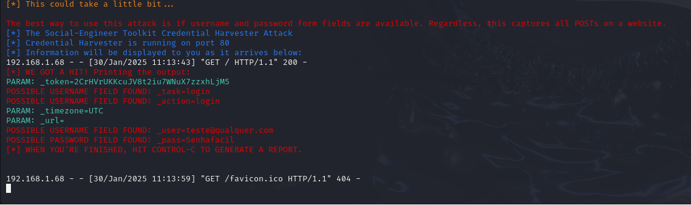

# testeciber
Repositório de testes e cursos

# Exemplo de Phishing com Kali Linux para captura de senhas de um site alvo
### Ferramentas Necessárias

### ATENÇÃO ESTE REPOSITÓRIO TEM COMO FUNÇÃO ÚNICA O APRENDIZADO E OS CONHECIMENTOS NÃO DEVEM SER APLICADOS PARA PREJUDICAR QUALQUER INDIVÍDUO/INSTITUIÇÃO

- Kali Linux
- setoolkit

# Depois que o sistema estiver instalado na máquina Virtual, iniciar o Setoolkit.

### Configurando o Phishing no Kali Linux

- Acesso root: ``` sudo su ```
- Iniciando o setoolkit: ``` setoolkit ```
- Tipo de ataque: ``` Social-Engineering Attacks ```
- Vetor de ataque: ``` Web Site Attack Vectors ```
- Método de ataque: ```Credential Harvester Attack Method ```
- Método de ataque: ``` Site Cloner ```
- Obtendo o endereço da máquina: ``` ifconfig ```
- URL para clone: http://mail.hostinger.com

### Resutados


